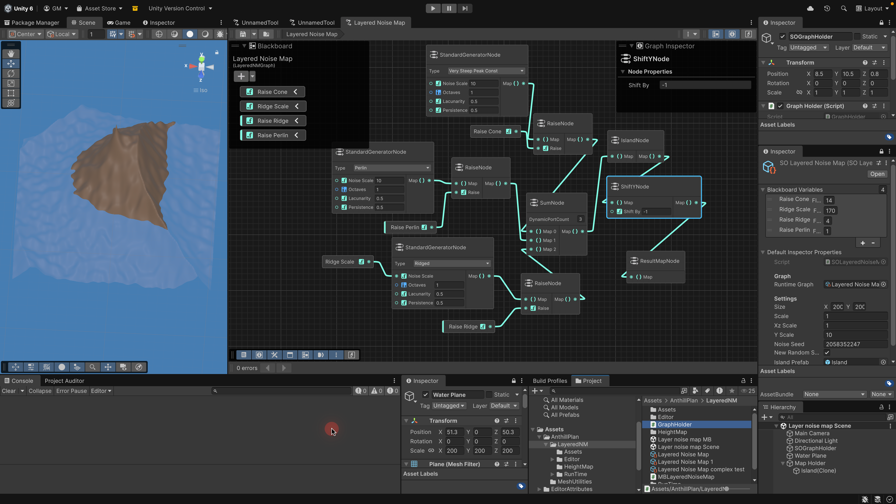

# README #

This ia unity 6000.2.10f1 URP project.

### What is this repository for? ###

* An intermediate example for Unity Graph Toolkit v0.4
* It allows creation of graphs to combine various noise maps and make a mesh for an island.
* [Video Documenting usage and code](https://youtu.be/sYjCOIz-uFo)

### How do I get set up? ###

* [Geeks for Geeks cycle detection algorithm](https://www.geeksforgeeks.org/dsa/detect-cycle-in-a-graph/)
* [Geeks for Geeks Topological Sorting using BFS - Kahn's Algorithm](https://www.geeksforgeeks.org/dsa/topological-sorting-indegree-based-solution/)
* [YouTube: Ultimate Heightmap Generator in Unity - From Noise to Worlds :: Perlin and other Noise code ](https://www.youtube.com/watch?v=wgo4r7EFazA)
* [HeightmapGeneratorUnity :: Original noise generator code  ](https://github.com/GameDevBox/HeightmapGeneratorUnity)
